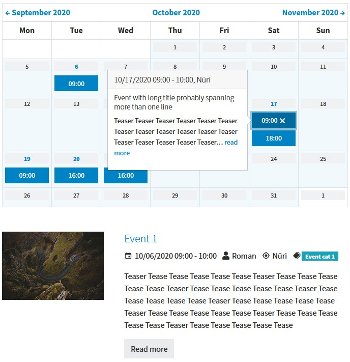

.. include:: /Includes.rst.txt

.. _admin_eventnews:

=====================
Extension `eventnews`
=====================

The extension `eventnews` adds additional fields to the `news` extension allowing
to define events and provides a view to show them in a month based calendar.
This extension alters the standard calendar view by removing the filter panel
and showing event information within the calendar by means of popup dialogs
(`see example <https://pizpalue.buechler.pro/das-plus/eventnews/>`__).

   Calendar view from events

To use the calendar view provided by this extension the static
`Pizpalue - eventnews (pizpalue)` needs to be added to
`Include static (from extensions)` from the template record. The resulting
template hierarchy would be as following:

#. News (news)
#. News Styles Twitter Bootstrap V5 (news)
#. Eventnews (eventnews)
#. Pizpalue - news (pizpalue)
#. Pizpalue - eventnews (eventnews)

.. note::

   Currently there is an issue in showing the month view (
   `see issue 132 <https://github.com/georgringer/eventnews/issues/132>`__).
   This might be corrected by adding the following dependency injection
   configuration to the site package (EXT:my_site/Configuration/Services.yaml):

   `GeorgRinger\News\Controller\NewsController: '@GeorgRinger\Eventnews\Controller\NewsController'`
