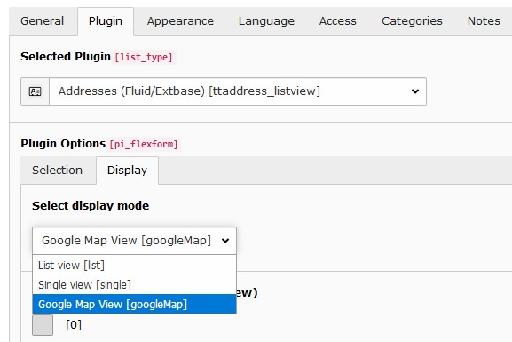
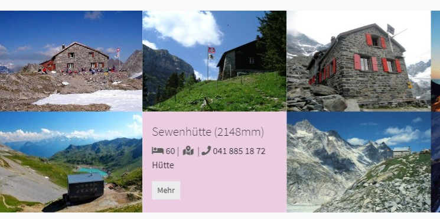
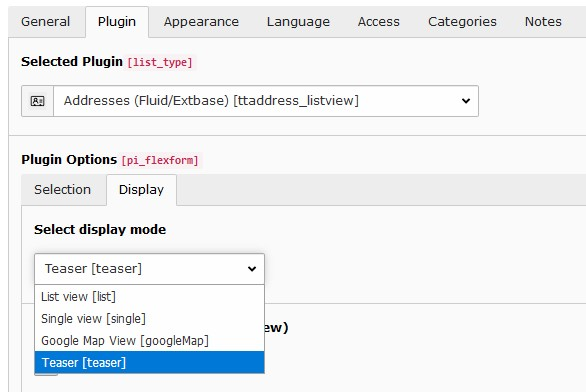

.. include:: ../../Includes.txt

.. _admin_ttaddress:

====================
Extension tt_address
====================

.. _admin_ttaddress_common_setup:

Common setup steps
===================

The below mentioned packages are available through the "Display mode" available in the plugin content element.

The setup steps are similar:

#. Add static template "Pizpalue - tt_address [package name]"
#. Add TypoScript Configuration to resources from page property
#. Configure the package in the constant editor (category "PIZPALUE: PLUGINS", section "Addresses (tt_address)")
#. Add the address plugin to a page and select the corresponding view (Plugin options - Display tab -
   Select display mode)

.. _admin_ttaddress_googlemap:

Google map
==========

This package adds a Google map showing the selected addresses.

.. figure:: ../../Images/Administration/TtAddress/GoogleMap/Map.jpg
   :width: 500px
   :alt: Map showing addresses from table tt_address

   Map showing addresses from table tt_address

Setup
-----

Carry out the :ref:`common setup steps <admin_ttaddress_common_setup>`.

   "Google Map View" in the "Display mode" from the plugin content element

.. note::
   This package adds its Fluid templates and partials to index 20
   (see TS setup "plugin.tx_ttaddress.view.templateRootPaths"). To overrule these files add own resources under a higher
   index.

Customization
-------------

The markers info window might be customized by overriding the templates partial (file "typo3conf/ext/pizpalue/
Extensions/tt_address/GoogleMap/Resources/Private/Partials/GoogleMap.html"). The content is defined in the tag with id
"pp-ttaddress-maptemplate":

.. code-block:: html

   

      

         

            
         

         

            <h6>&nbsp;()</h6>
            

            

               <b data-pp-amt="name"></b> 
               Tel: &nbsp;|&nbsp;
               <a href="#" data-pp-amt="email">Email</a>&nbsp;|&nbsp;
               <a href="#" target="_blank" data-pp-amt="www">Web</a>
            

         

      

   

Since the data for each address is assigned to a marker through JS some data attributes and class names serve a
special need.

Template attributes
~~~~~~~~~~~~~~~~~~~

========================= ==========================================================================================
Template attribute        Function
========================= ==========================================================================================
data-pp-amt-markertitle   Defines the address field used for the markers title shown when hovering over the marker
data-pp-amt-uid           The uid from the address the content is derived from
data-pp-amt               The value indicates the field used for replacing the tags content
========================= ==========================================================================================

Data attributes
~~~~~~~~~~~~~~~

========================= ==========================================================================================
Data attribute            Function
========================= ==========================================================================================
data-pp-amd-uid           Specifies the address record uid holding the data for the infowindow
data-pp-amd-imageuri      The uri from the image to be shown in the infowindow
data-pp-amd-uri           The uri to show the address details
========================= ==========================================================================================

Classes
~~~~~~~

========================= ==========================================================================================
Class                     Function
========================= ==========================================================================================
pp-ttaddress-maptemplate  Identifies the template for the marker info window (is sibling from pp-ttaddress-map)
pp-amt-image              Identifies the image
========================= ==========================================================================================

.. _admin_ttaddress_teaser:

Teaser
======

This package provides a teaser showing random address item as flip cards.

   Teaser showing random address item as flip cards

Setup
-----

Carry out the :ref:`common setup steps <admin_ttaddress_common_setup>`.

   "Teaser View" in the "Display mode" from the plugin content element

.. note::
   This package adds its Fluid templates and partials to index 22
   (see TS setup "plugin.tx_ttaddress.view.templateRootPaths"). To overrule these files add own resources under a higher
   index.

Customization
-------------

The package provides several configuration constants allowing to define the view for different screen sizes. For further
customizations the template might be overruled.