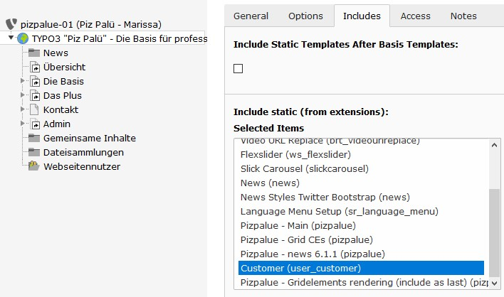

.. include:: ../Includes.txt

.. _administration:

==============
Administration
==============

.. _admin_installation:

Installation
============

The distribution can be installed from within the distribution list, by uploading the extension and through composer.
Refer to TYPO3 documentation for further details on handling extensions.

.. _admin_installation_supported_extensions:

Supported extensions
--------------------

================================ ================
Extension                        Version tested
================================ ================
indexed_search                   9.5.14
news                             7.3.1
tt_address                       5.0.0
timelog                          1.5.3
================================ ================

.. note::

   In case one of the supported extensions is being used it should be installed prior installing this distribution.
   This ensures that already predefined records for supported extensions are being imported during installing the
   distribution.

.. warning::

   In case an other extension version is used it is recommended to create a backup before installing it.

.. _admin_installation_with_typo3:

With TYPO3
----------

Follow these steps to install supported extension with the distribution:

#. Go to the extension manager
#. Install ``supported extensions (news, tt_address, timelog)`` as needed
#. Select 'Get preconfigured distribution'
#. Search for ``Piz Palü Distribution`` and install it

.. _admin_installation_with_composer:

With composer
-------------

Adding the extension to a composer based installation:

.. highlight:: bash

::

   composer require buepro/typo3-pizpalue

Installing TYPO3 with pizpalue-distribution:

.. highlight:: json

::

   {
       "name": "buepro/typo3-cms-pizpalue",
       "description": "TYPO3 with pizpalue distribution",
       "type": "project",
       "repositories": [
           {
               "type": "composer",
               "url": "https://composer.typo3.org/"
           }
       ],
       "require": {
           "buepro/typo3-pizpalue": "~11.0"
       },
       "extra": {
           "typo3/cms": {
               "web-dir": "web"
           }
       },
       "license": "MIT",
       "authors": [
           {
               "name": "Roman",
               "email": "rb@buechler.pro"
           }
       ],
       "minimum-stability": "stable"
   }

After the extension has been added install it in the extension manager.

.. _admin_update:

Update
======

After updating this distribution in the extension manager the data base structure should be analysed in the maintenance
module.

.. _admin_upgrade:

Upgrade
=======

The following upgrade descriptions are available:

.. toctree::
   :maxdepth: 2

   Upgrade9
   Upgrade11
   UpgradeBootstrap4

.. _admin_customization:

Customization
=============

The suggested way to customize the distribution for customer projects is to create an extension (e.g. user_customer)
and define the customer theme and functions in it (`see TYPO3 documentation
<https://docs.typo3.org/typo3cms/ExtbaseFluidBook/4-FirstExtension/Index.html>`__).

An example extension for that purpose is delivered and activated with the distribution. You might use it as your
starting point.

   Customize the distribution for customer projects

The extension might be deactivated by removing its static template or by uninstalling it. To prevent the extension
``user_customer`` from being installed the checkbox ``Install pizpalue with customer extension`` in the ``Extension
Configuration`` from the settings module might be deactivated.

.. _admin_extensions:

Extensions
==========

For some extensions additional packages are available:

.. toctree::
   :maxdepth: 1

   Extensions/Form
   Extensions/News
   Extensions/TtAddress
   Extensions/Felogin

.. _admin_development:

Development
===========

During development or maintenance phase two actions might be of interest:

#. Show under construction page
#. Enable code debugging

To temporarily show an under construction page an url redirection might be created to the page "In Arbeit" and the code
debugging might be enabled by setting the site mode in the "PIZPALUE: AGENCY" category from the constant editor.
