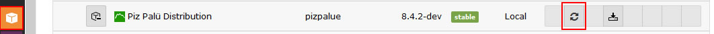
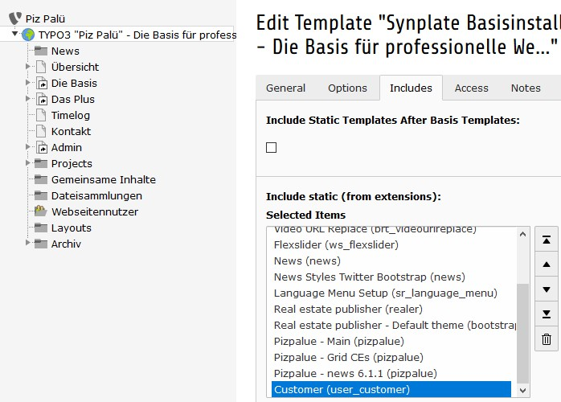
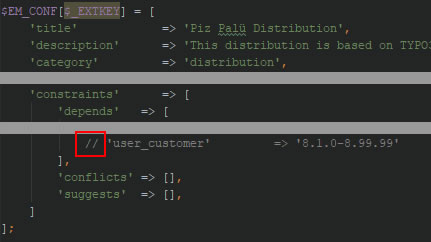

.. include:: ../Includes.txt

.. _administration:

Administration
==============

.. _admin_installation:

Installation
------------

The distribution can be installed from within the distribution list, by uploading the extension and through composer.
Refer to TYPO3 documentation for further details on handling extensions.

.. _admin_update:

Update
------

If a newer version from this distribution is installed its update script should be executed. It can be started through
its update button available through the extension manager.

   Distribution update button

.. _admin_customization:

Customization
-------------

The suggested way to customize the distribution for customer projects is to create an extension (e.g. user_customer)
and define the customer theme and functions in it (`see TYPO3 documentation
<https://docs.typo3.org/typo3cms/ExtbaseFluidBook/4-FirstExtension/Index.html>`__).

An example extension for that purpose is delivered and activated with the distribution. You might use it as your
starting point.

   Customize the distribution for customer projects

The extension might be deactivated by removing its static template.

To uninstall the extension the dependency in the file ext_emconf.php needs to be removed.

   Remove or mark as comment the dependency to the extension user_customer

.. _admin_development:

Development
-----------

During development or maintenance phase two actions might be of interest:

#. Show under construction page
#. Enable code debugging

To temporarily show an under construction page the page "Baustelle" might be
moved before the root page where the code debugging can be enabled by activating
the debug mode in the "PIZPALUE: AGENCY" category from the constant editor.

.. _admin_configuration:

Configuration
-------------

Many aspects from the web site can be configured through the constant editor.

To ease configuration parameters were grouped. The following main categories
are available:

============================ ==================================================
Category                     Description
============================ ==================================================
PIZPALUE: GENERAL            A parameter in this category might be used for various module configurations
PIZPALUE: AGENCY             Everything related to the authority maintaining the site
PIZPALUE: CUSTOMER           Main customer related parameters
PIZPALUE: CUSTOMER STYLE     More detailed customer style related parameters
PIZPALUE: CUSTOMER SOCIAL    Definition from references to social networks
PIZPALUE: CUSTOMER VARIOUS   More detailed customer related parameters
============================ ==================================================

.. figure:: ../Images/Administration/Configuration_ConstantEditor.jpg
   :alt: Constant editor

   Constant editor

