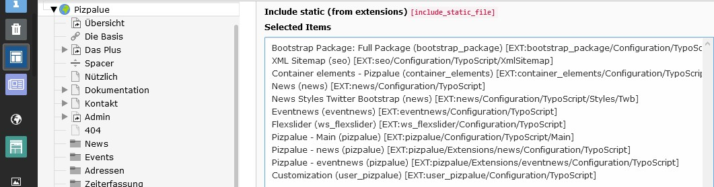

.. include:: ../Includes.txt

.. _administration:

==============
Administration
==============

.. _admin_installation:

Installation
============

Refer to TYPO3 documentation for further details on
`installing extensions <https://docs.typo3.org/m/typo3/guide-installation/master/en-us/ExtensionInstallation/Index.html>`__.

.. _admin_installation_static_templates:

Static templates
----------------

In an installation using `container_elements`, `news`, `eventnews` and `ws_flexslider` the following static extension
templates would be included:

.. _admin_installation_supported_extensions:

Supported extensions
--------------------

================================ ================
Extension                        Version tested
================================ ================
bookmark_pages                   2.0.1
container_elements               2.1.1
flux_elements                    1.2.1
timelog                          1.6.0
pp_gridelements                  1.1.0
tt_address                       5.2.1
eventnews                        4.0.0
news                             8.5.2
ws_flexslider                    1.5.16
indexed_search                   10.4.16
================================ ================

Structure elements
------------------

Currently the extensions `gridelements`, `flux`, and `container` are supported. It is strongly recommended to just
use one from the mentioned extensions due to possible conflicts that might occur when using them concurrently.

.. _admin_update:

Update
======

After updating this extension in the extension manager the data base structure should be analysed in the maintenance
module.

.. _admin_upgrade:

Upgrade
=======

.. note::
   Upgrade tasks are only needed to be carried out in case breaking changes were introduced between the old and new
   release. Breaking changes are marked with `[!!!]` in the
   `commit messages <https://github.com/buepro/typo3-pizpalue/commits/master>`__. The :ref:`changelogs <changelog>`
   might contain a section listing introduced breaking changes.

The following upgrade descriptions are available:

.. toctree::
   :maxdepth: 2

   Upgrade_11.0
   Upgrade_11.2
   Upgrade_11.4
   UpgradeBootstrap4

.. _admin_extensions:

Extensions
==========

For some extensions additional packages are available:

.. toctree::
   :maxdepth: 1

   Extensions/Form
   Extensions/News
   Extensions/Eventnews
   Extensions/TtAddress
   Extensions/Felogin

.. _admin_development:

Development
===========

During development or maintenance phase two actions might be of interest:

#. Show under construction page
#. Enable code debugging

To temporarily show an under construction page an url redirection might be created and the code debugging might be
enabled by setting the site mode in the "PIZPALUE: AGENCY" category from the constant editor.
