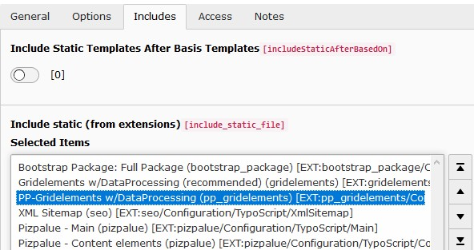

.. include:: ../Includes.txt

.. _admin_upgrade_11.x:

========================================================================
Upgrade to version 11.x (TYPO3 V10 LTS compatibility, not available yet)
========================================================================

With this upgrade elements for the extension `gridelements` have been outsourced to the extension `pp_gridelements`.

When upgrading TYPO3 from version 9 LTS to version 10 LTS the following steps are suggested to be carried out:

#. Uninstall all local extensions except `gridelements`
#. Upgrade TYPO3 to version 10 LTS
#. Go to `Install tool - Upgrade module - Upgrade wizard` and carry out all update steps
#. Upgrade all local extensions
#. Install extension `pizpalue`
#. Install extension `pp_gridelements`
#. Open the (root-) template record and adapt the `Include static` box as following:

   - Remove `Pizpalue DEPRECIATED - Gridelements CEs`
   - Remove `Pizpalue DEPRECIATED - Gridelements rendering (include as last)`
   - Replace `Gridelements` with `Gridelements w/DataProcessing (recommended)`
   - Add `PP-Gridelements w/DataProcessing`

   Include static box from root template record
