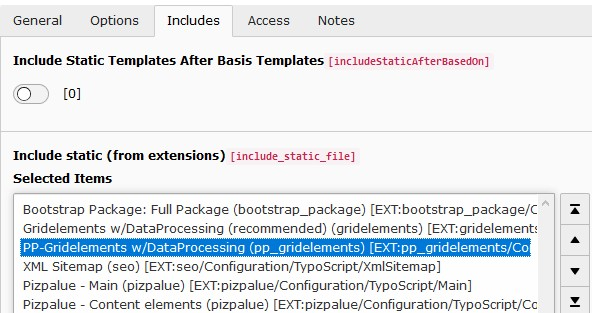

.. include:: ../Includes.txt

.. _admin_upgrade_11.2:

=====================================================
Upgrade to version 11.2 (TYPO3 V10 LTS compatibility)
=====================================================

Gridelements
============

With this upgrade elements for the extension `gridelements` have been outsourced to the extension `pp_gridelements`.

When upgrading TYPO3 from version 9 LTS to version 10 LTS the following steps are suggested to be carried out:

#. Uninstall all local extensions except `gridelements`
#. Upgrade TYPO3 to version 10 LTS
#. Go to `Install tool - Upgrade module - Upgrade wizard` and carry out all update steps
#. Upgrade all local extensions
#. Install extension `pizpalue`
#. Install extension `pp_gridelements`
#. Open the (root-) template record and adapt the `Include static` box as following:

   - Remove `Pizpalue DEPRECIATED - Gridelements CEs`
   - Remove `Pizpalue DEPRECIATED - Gridelements rendering (include as last)`
   - Replace `Gridelements` with `Gridelements w/DataProcessing (recommended)`
   - Add `PP-Gridelements w/DataProcessing`

   Include static box from root template record

Automatic image scaling
=======================

Introduction
------------

A mechanism to automatically scale images used in structure elements has been introduced. This allows to render images
being used in columns with the width from the column hence improving the page loading time. Extension providing
structure elements (e.g. `pp_gridelements`, `flux_elements`) might make use of this feature.

Previously the image size could be adjusted by means of the field `Image scaling` found under the content elements
`Image` tab.

Corrective action
-----------------

Review the field `Image scaling` found under the content elements `Image` tab. When using the
latest versions from the structure extensions (e.g. `pp_gridelements`, `flux_elements`) the field might need to be set
to its default value.
