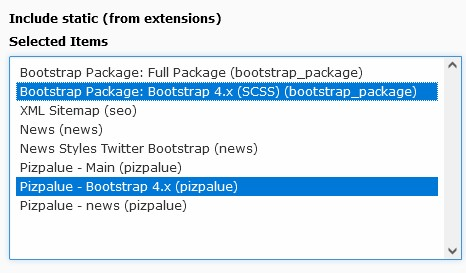

.. include:: ../Includes.txt

.. _admin_upgrade_11.4:

==========================================
Upgrade to version 12.0
==========================================

Version 12 adapts to version 12 from the bootstrap package hence provides compatibility with
`TYPO3 version 11 <https://typo3.org/help/documentation/whats-new>`__ and
`bootstrap framework version 5 <https://getbootstrap.com>`__.

Using bootstrap 4
=================

Bootstrap 5 is enabled by default. To use bootstrap 4 the related static templates need to be loaded as following:

*  "Bootstrap Package: Bootstrap 4.x (SCSS)" after "Bootstrap Package: Full Package"
*  "Pizpalue - Bootstrap 4.x" after "Pizpalue - Main"

   Static templates to use bootstrap 4
