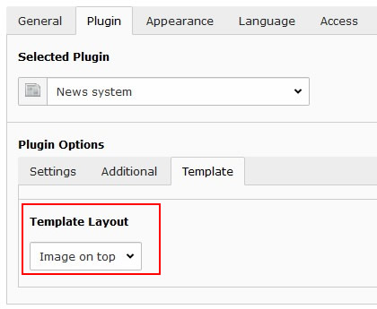

.. include:: ../../Includes.txt

.. _config_news:

=====================
Extension `news`
=====================

Layout
======

For the news system a template "Image on top" is provided. It might be used to
render the image on top of the text (`see example <https://pizpalue.buechler.pro/das-plus/news/>`__).

   News template to render image on top
