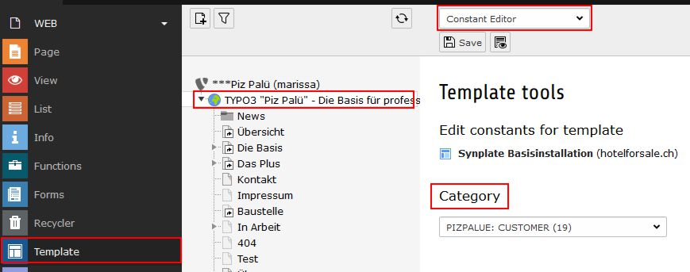

.. include:: ../Includes.txt

.. _configuration:

=============
Configuration
=============

.. _config_installtool:

Install tool
============

Consider to review the below mentioned entries in the installtool.

.. code-block:: php

   $GLOBALS['TYPO3_CONF_VARS']['SYS']['ddmmyy'] = 'd.m.y';
   $GLOBALS['TYPO3_CONF_VARS']['SYS']['hhmm'] = 'H:i';
   $GLOBALS['TYPO3_CONF_VARS']['SYS']['phpTimeZone'] = 'Europe/Zurich';
   $GLOBALS['TYPO3_CONF_VARS']['SYS']['systemLocale'] = 'de_CH.utf8';
   $GLOBALS['TYPO3_CONF_VARS']['BE']['lockSSL'] = true;

.. tip::
   The above mentioned configurations might be part from the file "typo3conf/AdditionalConfiguration.php".
   A sample file is provided in the directory "typo3conf/ext/pizpalue/Resources/Private/FolderStructureTemplateFiles".

.. _config_constantEditor:

Constant editor
===============

Many aspects from the web site can be configured through the constant editor.

To ease configuration parameters were grouped. The following main categories
are available:

============================ =========================================================
Category                     Description
============================ =========================================================
PIZPALUE: ADMIN              Everything related to the site administration
PIZPALUE: CUSTOMER BASE      Main customer related parameters
PIZPALUE: CUSTOMER STYLE     More detailed customer style related parameters
PIZPALUE: CUSTOMER SOCIAL    More detailed customer social network related parameters
PIZPALUE: CUSTOMER VARIOUS   More detailed customer related parameters
PIZPALUE: CUSTOMER PLUGINS   More detailed plugin related parameters
============================ =========================================================

.. note::
   Most extensions provide their own configurations. For more detailed configurations consult the related manual.

.. _config_seo:

SEO
===

Prerequisites
-------------

#. Review content (focus on user experience)
#. Review seo tags like title-tag and description meta-tag

TYPO3 version 8LTS
------------------

You might follow these steps to setup seo features:

#. Consider installing the extensions realurl, dd_googlesitemap and url_forwarding
#. Verify 404-handling. You might need to adjust configurations by help of the install tool
   (e.g. pageNotFound_handling).
#. Review sitemap by adding `?eID=dd_googlesitemap <https://www.pizpalue.buechler.pro/?eID=dd_googlesitemap>`__ to
   the domain

.. _config_404:

404-Handling
~~~~~~~~~~~~

The 404-handling can be configured in the install tool. An example configuration might look as following:

========================================== ===================================================
Parameter                                  Value
========================================== ===================================================
[FE][pageNotFound_handling]                REDIRECT:https://www.pizpalue.buechler.pro/404/
[FE][pageNotFound_handling_statheader]     HTTP/1.0 404 Not Found
========================================== ===================================================

TYPO3 version 9LTS
------------------

You might follow these steps to setup seo features:

#. Create a `site <https://docs.typo3.org/typo3cms/CoreApiReference/ApiOverview/SiteHandling/Index.html>`__ (a sample
   configuration file can be found in the directory
   typo3conf/ext/pizpalue/Resources/Private/FolderStructureTemplateFiles)

.. _config_google:

Google
------

To register the website at Google follow these steps:

#. Register domain as new property at search console
#. Verify ownership by adding google-site-verification code to the related seo constant (see figure below)
#. Register sitemap at search console
#. Register domain in google analytics
#. Add google analytics code to the related seo constant (see figure below)

.. figure:: ../Images/Configuration/ConstantEditorSeo.jpg
   :width: 500px
   :alt: SEO related constants in "PIZPALUE CUSTOMER" category

   SEO related constants in "PIZPALUE CUSTOMER" category

.. _config_scrollanimation:

Scroll animation
================

This feature is using the `AOS-library <http://michalsnik.github.io/aos/>`__ and is enabled by default. It allows to
animate content elements while the page is being scrolled.

Use the constant editor to disable the feature (category "PIZPALUE: CUSTOMER BASE - Features") or configure it
further (category "PIZPALUE: CUSTOMER VARIOUS - Animation").

Four preconfigured animations are available in the animation dropdown menu from the appearance tab in the content
element properties dialog. Those animations might be configured as well in the constant editor (category "PIZPALUE:
CUSTOMER VARIOUS - Animation").

.. _config_cookieconsent:

Cookie consent
==============

To show a cookie dialog the "Enable Cookie Consent"-parameter has to be set (constant editor category "PIZPALUE:
CUSTOMER BASE - Cookie consent"). As well a link to a privacy policy page can be set for the cookie dialog.

Further configurations regarding the cookie dialog can be found in the constant editor by selecting the category
"PIZPALUE: CUSTOMER VARIOUS" under the section "Cookie consent".

.. note::
   For Google Analytics a control block can be embedded by using the string ###GoogleAnalyticsStatus### in a content
   element.

.. _config_appIcons:

App icons
=========

In case just a simple favicon is required it can be specified in the category "PIZPALUE - CUSTOMER BASE" from the
constants editor.

To get an app icon set for all major platforms the resources might be generated at the
`"Favicon generator" <https://realfavicongenerator.net/>`__ website. The resulting resources need to be copied to the
server web directory and the header data assigned to the related field in the app icon section in the category
"PIZPALUE - CUSTOMER BASE" from the constants editor. Remove any line breaks.
