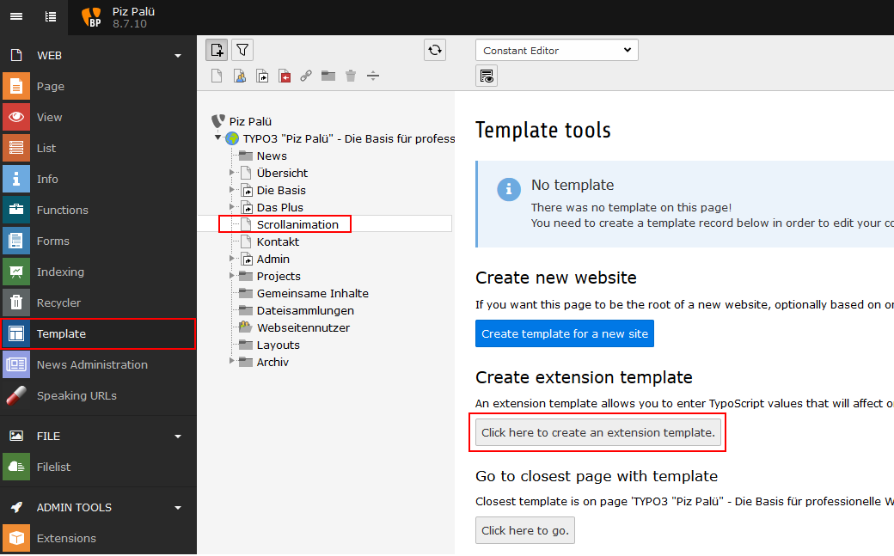
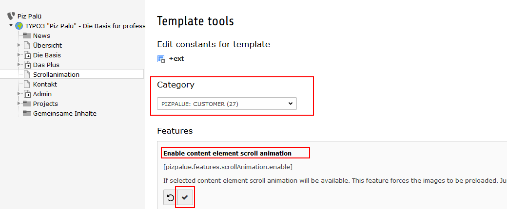

.. include:: ../Includes.txt

.. _config:

Configuration
==============

.. _installtool:

Install tool
------------

Consider to review the below mentioned entries in the installtool.

.. code-block:: php

   $GLOBALS['TYPO3_CONF_VARS']['SYS']['ddmmyy'] = 'd.m.y';
   $GLOBALS['TYPO3_CONF_VARS']['SYS']['hhmm'] = 'H:i';
   $GLOBALS['TYPO3_CONF_VARS']['SYS']['phpTimeZone'] = 'Europe/Zurich';
   $GLOBALS['TYPO3_CONF_VARS']['SYS']['systemLocale'] = 'de_CH.utf8';

.. _config_seo:

SEO
---

You might follow these steps to setup seo features:

#. Install `extension realurl <https://extensions.typo3.org/extension/realurl/>`__
#. Verify 404-handling. You might need to adjust configurations by help of the install tool (e.g. pageNotFound_handling).
#. Review sitemap by adding `?eID=dd_googlesitemap <https://www.pizpalue.buechler.pro/?eID=dd_googlesitemap>`__ to the domain
#. Review seo tags like title-tag and description meta-tag
#. Register domain as new property at google search console
#. Verify ownership by adding google-site-verification code to the related seo constant (see figure below)
#. Register domain in google analytics
#. Add google analytics code to the related seo constant (see figure below)

.. figure:: ../Images/Configuration/ConstantEditorSeo.jpg
   :width: 500px
   :alt: SEO related constants in "PIZPALUE CUSTOMER" category

   SEO related constants in "PIZPALUE CUSTOMER" category

.. _config_404:

404-Handling
------------

The 404-handling can be configured in the install tool. An example configuration might look as following:

========================================== ===================================================
Parameter                                  Value
========================================== ===================================================
[FE][pageNotFound_handling]                REDIRECT:https://www.pizpalue.buechler.pro/404/
[FE][pageNotFound_handling_statheader]     HTTP/1.0 404 Not Found
========================================== ===================================================

.. _config_scrollanimation:

Scroll animation
----------------

The feature can be enabled in the constant editor (:ref:`PIZPALUE: CUSTOMER - Features <ScrollAnimation_ConstantEditor>`).

Since this feature is based on the dimensions from the visible area and the content element problems might come up
where the content element dimensions change upon scrolling, like it is the case with the lazy image loading feature.
This is why the images are configured to be fully preloaded when the scroll animation feature is enabled. This might be
overwritten with the following TS:

.. code-block:: typoscript

   lib.contentElement.settings.preload.images = 0

Enable scroll animation
~~~~~~~~~~~~~~~~~~~~~~~

To enable the scroll animation for a certain page follow these steps:

1. Create extension template for page

.. _ScrollAnimation_ConstantEditor:

2. Enable scroll animation in constant editor

.. _config_cookieconsent:

Cookie consent
--------------

To show a cookie dialog the "Enable Cookie Consent"-parameter has to be set (available through the constant editor
under "PIZPALUE: CUSTOMER"). As well a link to a privacy policy page can be set in the cookie dialog.

Further configurations regarding the cookie dialog can be found und "PIZPALUE: CUSTOMER VARIOUS" in the constant editor.

.. _info:
   For Google Analytics a control block can be embedded by using the string ###GoogleAnalyticsStatus### in a content
   element.

.. _note:
   The cookie dialog is rendered with a partial. You might need to update your template by embedding

.. code-block:: xml

   <f:render partial="Structure/CookieConsent" arguments="{_all}" />

.. _socialNetwork:

Social networks
---------------

Links to social networks can easyly be embedded by using the string ###SocialNetwork###
some where in a content element.

By default the `"Font Awesome" <https://fontawesome.com/>`__ library is used for
this purpose. This library provides an extensive icon set. Even the `TYPO3 logo
<https://fontawesome.com/icons?d=gallery&q=typo3>`__ is available.

Many icons are as well available with the `Ionicon library <https://ionicons.com/>`__
provided by the bootstrap_package. Unfortunatly the TYPO3-icon as well as the
Xing-icon are missing. In case those icons aren't needed the "Font Awesome"
library might be disabled to gain page load speed. The related parameter can be
found under the "Features" section in the constant editor selecting "PIZPALUE: CUSTOMER".
