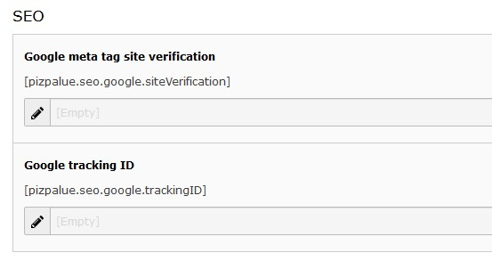

.. include:: ../Includes.txt

.. _configuration:

Configuration
==============

.. _seo:

SEO
---

You might follow these steps to setup seo features:

#. Install `extension realurl <https://extensions.typo3.org/extension/realurl/>`__
#. Verify 404-handling. You might need to adjust configurations by help of the install tool (e.g. pageNotFound_handling).
#. Review sitemap by adding `?eID=dd_googlesitemap <https://www.pizpalue.buechler.pro/?eID=dd_googlesitemap>`__ to the domain
#. Review seo tags like title-tag and description meta-tag
#. Register domain as new property at google search console
#. Verify ownership by adding google-site-verification code to the related seo constant (see figure below)
#. Register domain in google analytics
#. Add google analytics code to the related seo constant (see figure below)

   SEO related constants in "PIZPALUE CUSTOMER" category

.. _404:

404-Handling
------------

The 404-handling can be configured in the install tool. An example configuration might look as following:

========================================== ===================================================
Parameter                                  Value
========================================== ===================================================
[FE][pageNotFound_handling]                REDIRECT:https://www.pizpalue.buechler.pro/404/
[FE][pageNotFound_handling_statheader]     HTTP/1.0 404 Not Found
========================================== ===================================================
