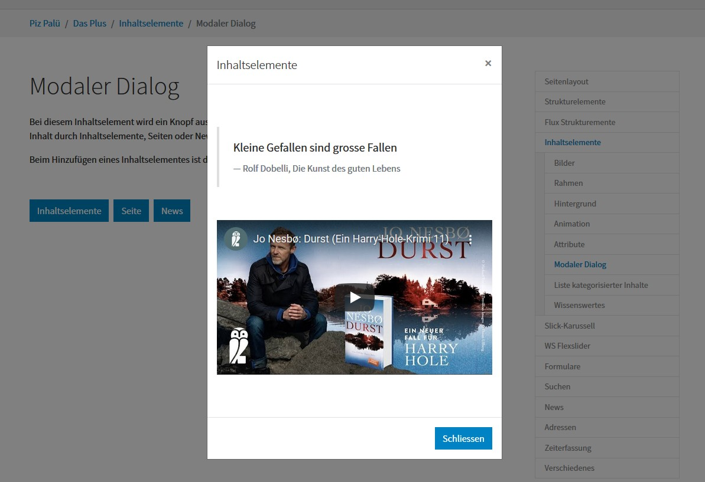

.. include:: ../Includes.txt

.. _introduction:

============
Introduction
============

Preface
=======

This extension started as a distribution and is now a template serving as a base
foundation for new websites. The former distribution part became to be a new
distribution called `pizpalue_distribution` and can be downloaded from
`the TYPO3 extension repository <https://extensions.typo3.org/extension/pizpalue_distribution>`__.

What does it do?
================

The extension builds upon the extension `bootstrap_package from Benjamin Kott <https://extensions.typo3.org/extension/bootstrap_package>`__
and serves as a base template for the creation of websites or
`distributions <https://docs.typo3.org/m/typo3/reference-coreapi/master/en-us/ExtensionArchitecture/CreateNewDistribution/Index.html>`__
using the `bootstrap framework <https://getbootstrap.com/>`__. As an example the
distribution `pizpalue_distribution <https://extensions.typo3.org/extension/pizpalue_distribution>`__
uses this extension. A demo site can be visited `here <http://pizpalue.buechler.pro/das-plus/>`__.

The extension extends and configures TYPO3 and selected extensions to provide
better structured and attracting content while maintaining or improving speed
and seo performance.

It provides the following main features:

Arranging content
-----------------

- Page layouts allowing to add content in side columns with a menu
- Support for structure elements provided by
  `container_elements <https://extensions.typo3.org/extension/container_elements>`__.
  Example structure elements are: columns, grid, accordion, tabs, card, tile unit
  and randomizer

Enhancing content
-----------------

- Support for automatic image scaling in structure elements (see :ref:`integration_templating`)
- Content element fields to optimize image scaling dependent on the screen size.
- Content element fields to assign custom classes, styles and attributes

Animating content
-----------------

- Animation effects provided `animate.css <https://github.com/animate-css/animate.css>`__
- Scroll animation effects provided by `Twikito/onscroll-effect <https://github.com/Twikito/onscroll-effect>`__,
  `Josh.js <https://github.com/mamunhpath/josh.js>`__ or `AOS <https://github.com/michalsnik/aos>`__
- A feature to reveal the footer

New content elements
--------------------

- A content element to create modal dialogs
- A content element to create a list of categorized content elements
- A content element to create structured content (JSON-LD data, see :ref:`user-contentElements-schema`)
- A layout for media content elements to emphasize media

Supporting extensions
---------------------

The following extensions are supported:

- `container_elements <https://extensions.typo3.org/extension/container_elements>`__
- `news <https://extensions.typo3.org/extension/news>`__
- `eventnews <https://extensions.typo3.org/extension/eventnews>`__

Various
-------

- A menu to be fixed on the side (fastmenu)

Discover more regarding the features on the `demo site <http://pizpalue.buechler.pro/das-plus/>`__.

Screenshots
===========

The following screen shots were taken from a website created with the distribution
`pizpalue_distribution <https://extensions.typo3.org/extension/pizpalue_distribution>`__.

Structure elements
------------------

`See example <https://pizpalue.buechler.pro/das-plus/strukturemente>`__

.. figure:: ../Images/Introduction/StructureElements.jpg
   :width: 500px
   :alt: Page embedding contents covering entire page width

   Page embedding contents covering entire page width

Scroll animation
----------------

`See example <https://pizpalue.buechler.pro/das-plus/inhaltselemente/animation>`__

.. figure:: ../Images/Introduction/ScrollAnimationPage.jpg
   :width: 500px
   :alt: Page embedding scroll animated content

   Page embedding scroll animated content

Modal dialog
------------

See as well `demo site <https://pizpalue.buechler.pro/das-plus/inhaltselemente/modaler-dialog>`__.

News
----

`See example <https://pizpalue.buechler.pro/das-plus/news/>`__

.. figure:: ../Images/Introduction/NewsPage.jpg
   :width: 500px
   :alt: Page embedding news

   Page embedding news

Credits
=======

This extension can be provided thanks to outstanding work from TYPO3 community members. A big thanks goes to:

- Benjamin Kott, extension `bootstrap_package <https://extensions.typo3.org/extension/bootstrap_package>`__
- B13 GmbH, extension `container <https://extensions.typo3.org/extension/container>`__
- Georg Ringer, extensions `news <https://extensions.typo3.org/extension/news>`__,
  `eventnews <https://extensions.typo3.org/extension/eventnews>`__
- tt_address Development Team, extension `tt_address <https://extensions.typo3.org/extension/tt_address>`__
