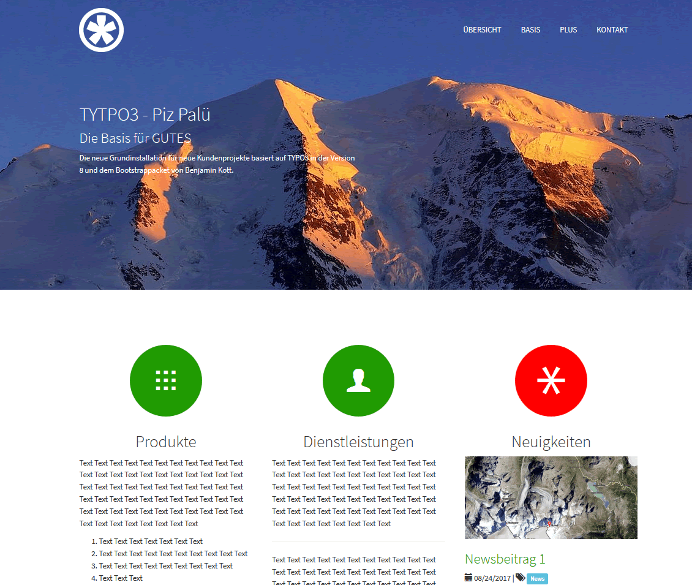

.. include:: ../Includes.txt

.. _introduction:

Introduction
============

.. _what-it-does:

What does it do?
----------------

This extension installs a bootstrap based web site with news management.
It is tailored for the Swiss market featuring German as default language and
additional translations to French and English.

Selected third party extensions further improve the user experience. As a result
the content might be flexibly arranged in columns, registers or accordions where images
might be presented in galleries or sliders.

Furthermore everything is on board to start search engine optimization.

Take advantage from the strong TYPO3 community and go for a flexible and independent
web site.

.. tip::

   This distribution is a result from ambitious members from the TYPO3 community.
   Special thanks goes to all the core members and the following 3rd party extension providers:

   - Benjamin Kott for the bootstrap_package

   - Georg Ringer for the news system

   - Pascal Mayer for bootstrap_grids

   - Dmitry Dulepov for realurl and dd_googlesitemap

   - Boris Schauer, Oliver Oertel for slickcarousel

   - Sven Wappler for ws_flexslider

   - Robert Breithuber for brt_videourlreplace

   - Stanislas Rolland for sr_language_menu

.. _screenshots:

Screenshots
-----------

This chapter should help people figure how the extension works. Remove it
if not relevant.

		   Website landing page

