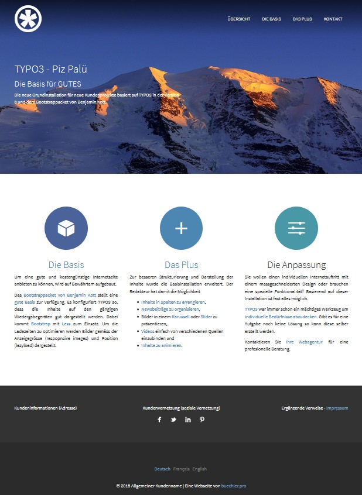
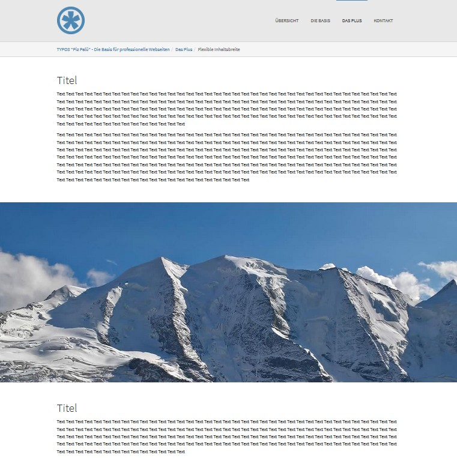
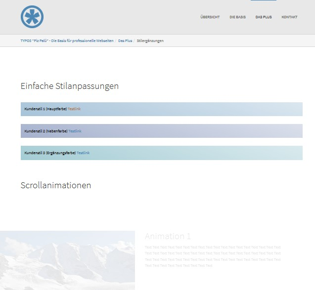
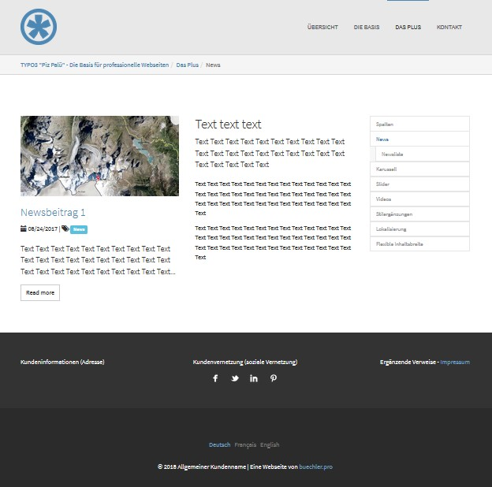

.. include:: ../Includes.txt

.. _introduction:

============
Introduction
============

.. _what-it-does:

What does it do?
================

This extension installs a bootstrap based web site with news, address and time management.
It is tailored for the Swiss market featuring German as default language and
additional translations to French, English and Finnish.

Selected third party extensions further improve the user experience. As a result
the content might be flexibly arranged in columns, registers or accordions where images
might be presented in galleries or sliders.

Discover the functionality by browsing through the `demo site <https://www.pizpalue.buechler.pro/>`__.

Take advantage from the strong TYPO3 community and go for a flexible and independent
web site.

.. tip::

   This distribution is a result from ambitious members from the TYPO3 community.
   Special thanks goes to all the core members and the following 3rd party extension providers:

   - Benjamin Kott for the bootstrap_package

   - Georg Ringer for the news system

   - Boris Schauer, Oliver Oertel for slickcarousel

   - Sven Wappler for ws_flexslider

.. _screenshots:

Screenshots
===========

Landing page
------------

`See example <https://www.pizpalue.buechler.pro/>`__

   Website landing page

----

Structure elements
------------------

`See example <https://www.pizpalue.buechler.pro/das-plus/strukturemente>`__

   Page embedding contents covering entire page width

----

Scroll animation
----------------

`See example <https://www.pizpalue.buechler.pro/das-plus/inhaltselemente/animation>`__

   Page embedding scroll animated content

----

News embedding
--------------

`See example <https://www.pizpalue.buechler.pro/das-plus/news/>`__

   Page embedding news
