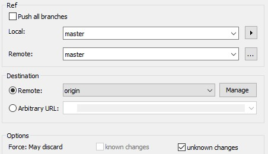

.. include:: ../../Includes.txt

.. _git:

====
Git
====

Reset
=====

To reset the master branch to a previous commit (from stackoverflow.com):

.. highlight:: bash

::

   git checkout master
   git reset --hard e3f1e37
   git push --force origin master

Then to prove it (it won't print any diff)

.. highlight:: bash

::

   git diff master..origin/master

   Tick 'unknown changes' in push dialog from TortoiseGit

