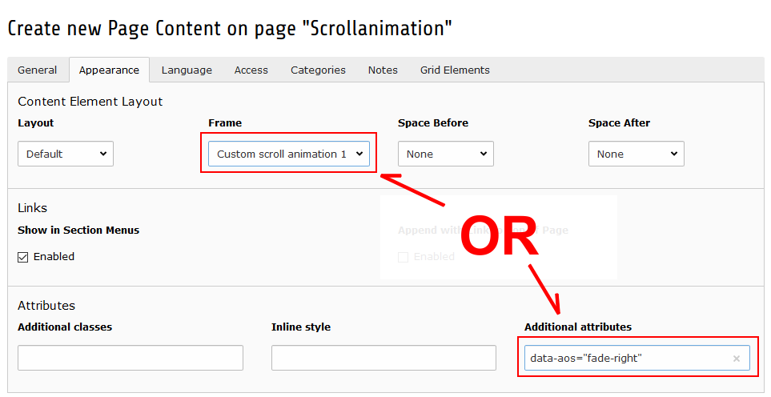

.. include:: ../Includes.txt

.. _user-animation:

=====================
Animation and effects
=====================

.. _usr-scrollanimation:

Scroll animation
================

The scroll animation feature allows to call further attention to content elements while the user is scrolling on the
page. Typically content elements are moved in from the side of the page.

To use this feature follow these steps:

1. Make sure the feature is enabled for the page where it is used (:ref:`see scroll animation configuration <config_scrollanimation>`)
2. Select a "Custom scroll animation" as a frame or specify the data attributes in the appearance tab from the content element

   Define the scroll animation either with a frame or withe data attributes

.. _usr-revealFooter:

Reveal footer
=============

An interesting feature is the footer to be revealed when scrolling down.
The user gets the impression like the content area forms a curtain being lifted
from the footer while scrolling to the end of the page.

To use this effect the constant "Reveal footer" can be set in the constant
editor. The constant can be found in "PIZPALUE: Customer - Frame".

.. note::
   This feature is using "position: fixed" which causes flickering in edge
   browsers. To correct the flickering "transform: translateZ(0)" is assigned to
   the preceeding sibling container. This cancels any fixed positioning in
   the sibling container. The situation might be improved by assigning
   "transform: translateZ(0)" to the last content element in the preceeding
   sibling element. In any case the element having "transform: translateZ(0)"
   assigned should be higher than the footer.
