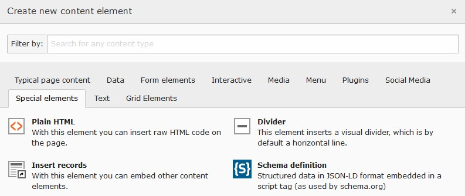

.. include:: ../Includes.txt

.. _user-contentElements:

================
Content elements
================

.. _user-contentElements-schema:

Schema
======

Placeholders
------------

The schema content element is used to insert structured data in JSON-LD format into the body tag by means of a script
tag. It allows to use placeholders in the JSON-LD code for `TS constants`,
`getText` `data types <https://docs.typo3.org/typo3cms/TyposcriptReference/DataTypes/Index.html#gettext>`__ and the
`processedData` array. The following table shows some placeholder examples:

+------------------------------------+---------------------+-----------------------------------------------------------+
| Placeholder example                | Type                | Description                                               |
+====================================+=====================+===========================================================+
| `{$pizpalue.customer.contactName}` | TS Constant         | Used as for TS setup: `{$constantName}`                   |
+------------------------------------+---------------------+-----------------------------------------------------------+
| `{data:field.teaser}`              | getText             | Wrap getText definition with `{data:|}`. When using the   |
|                                    |                     | key `field` data from the current content record          |
|                                    |                     | (`tt_content`) is obtained.                               |
+------------------------------------+---------------------+-----------------------------------------------------------+
| `{parentData:field.teaser}`        | getText             | Wrap getText definition with `{data:|}`. When using the   |
|                                    |                     | key `field` data from the parent record is obtained.      |
+------------------------------------+---------------------+-----------------------------------------------------------+
| `{processedData:schemaImages.0}`   | processedData array | Wrap the processedData array path with `{processedData:|}`|
|                                    |                     | In case the value from the `processedData` array is an    |
|                                    |                     | instance of `FileReference` the url to the file is        |
|                                    |                     | obtained.                                                 |
+------------------------------------+---------------------+-----------------------------------------------------------+

Functions
---------

Additionally the obtained data can be passed to a function. The following functions are available:

+----------------------+------------------------------------------------+----------------------------------------------+
| Function             | Example usage                                  | Description                                  |
+======================+================================================+==============================================+
| `entityEncodeChars`  | `{func:entityEncodeChars:info@domain.ch}`      | Each character from `info@domain.ch` will be |
|                      +------------------------------------------------+ converted to its entity. For example `i`     |
|                      | `{func:entityEncodeChars:{$cust.email}}`       | will be converted to `&#105;`                |
+----------------------+------------------------------------------------+----------------------------------------------+
| `newLineToRn`        | `{func:newLineToRn:{data:field:teaser}}`       | Converts line breaks to the character        |
|                      |                                                | sequence `\r\n`.                             |
+----------------------+------------------------------------------------+----------------------------------------------+

Content
-------

In the content element an image and a text can be defined. They might be used in the JSON-LD data with the following
placeholders:

======== ================================
Content  Placeholder
======== ================================
Text     `{data:field.teaser}`
Image    `{processedData:schemaImages.0}`
======== ================================

Example
-------

For this example an image as well as a text have been added to the content element. The image will be used for the
`logo` and the text for the `description` property.

**JSON-LD-code in content element:**

.. code-block:: json-ld

   {
     "@context" : "http://schema.org",
     "@type" : "Organization",
     "name": "{$pizpalue.customer.company}",
     "email": "{func:entityEncodeChars:{$pizpalue.customer.contactEmail}}",
     "telephone": "{$pizpalue.customer.contactPhone}",
     "faxNumber": "{$pizpalue.customer.contactFax}",
     "url" : "https://www.{$pizpalue.customer.domain}",
     "logo": "{processedData:schemaImages.0}",
     "description": "{data:field:teaser}",
     "address": {
       "@type": "PostalAddress",
       "addressLocality": "{$pizpalue.customer.contactCity}, Switzerland",
       "postalCode": "CH-{$pizpalue.customer.contactZip}",
       "streetAddress": "{$pizpalue.customer.contactAddress}"
     },
     "contactPoint" : [
       { "@type" : "ContactPoint",
         "telephone" : "{$pizpalue.customer.contactPhone}",
         "contactType" : "customer service"
       }
     ]
   }

**JSON-LD-code embedded into body tag:**

.. code-block:: json-ld

   {
     "@context" : "http://schema.org",
     "@type" : "Organization",
     "name": "Company GmbH",
     "email": "&#99;&#111;&#110;&#116;&#97;&#99;&#116;&#64;&#100;&#111;&#109;&#97;&#105;&#110;&#46;&#99;&#104;",
     "telephone": "111 111 11 11",
     "faxNumber": "111 111 11 12",
     "url" : "https://www.domain.ch",
     "logo": "http://pp10.buechler.pro/fileadmin/_processed_/3/9/csm_geran-de-klerk-136351_2571a74988.jpg",
     "description": "Development of mobile phones powered by propietary OS to guarantuee privacy.",
     "address": {
       "@type": "PostalAddress",
       "addressLocality": "Ort, Switzerland",
       "postalCode": "CH-1111",
       "streetAddress": "Strasse 1"
     },
     "contactPoint" : [
       { "@type" : "ContactPoint",
         "telephone" : "111 111 11 11",
         "contactType" : "customer service"
       }
     ]
   }
