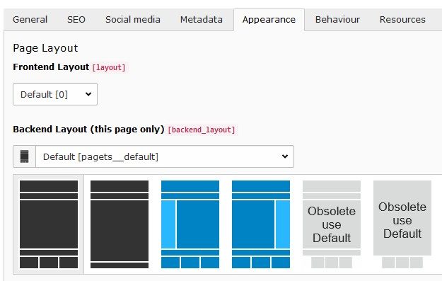
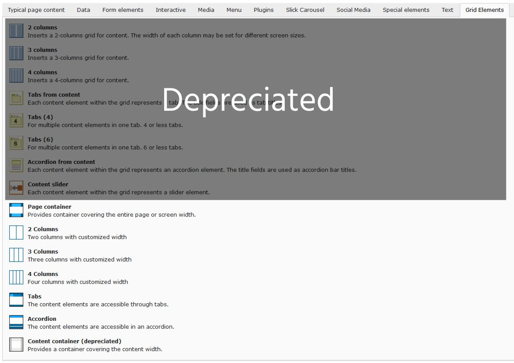
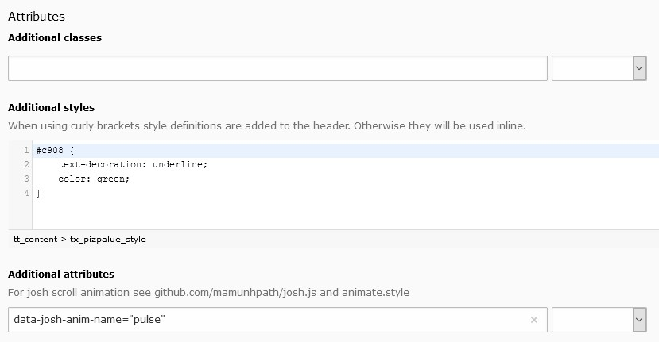

.. include:: ../Includes.txt

.. _user-design:

======
Design
======

The arrangement and appearance from content elements can be defined on different areas. The coarse structure is defined
with the page layout where structure elements like grid elements might further organize the content in columns,
registers, and the like. Fine tuning can be done on a content element basis by altering the frame, attributes and
background.

.. _user-design-page:

Page layout
===========

With a page layout the coarse page structure is defined. They can be selected in the page properties dialog under the
appearance tab. See as well `demo site <https://www.pizpalue.buechler.pro/das-plus/seitenlayout>`__.

   Available page layouts

.. note::
   The page layouts with a navigation menu on the side allow to add content too.

.. _user-structurelements:

Structure elements
==================

With structure elements the content area might be further organized. Typical elements are containers, columns,
accordions and tabs. See as well `demo site <https://www.pizpalue.buechler.pro/das-plus/strukturemente>`__.

Currently the content elements provided by the extension gridelements are used as structure elements. The available
grid elements can be found in the new content element wizard under the "Grid Elements" tab:

   "Grid Elements"-tab in new content element wizard

.. _user-design-contentElement:

Content element
===============

The appearance aspects from a content elements can be defined in the content element properties dialog under the
appearance tab.

.. _user-design-customframes:

Custom frames
-------------

Additional frames can be selected for content elements
(`see example <https://www.pizpalue.buechler.pro/das-plus/gestaltung/rahmen/>`__):

.. figure:: ../Images/User/CustomFrames.jpg
   :alt: Custom frames for content elements

   Custom frames for content elements

.. note::
   The custom frame 4 doesn't have any style definition. You might use it according your needs.

.. _user-design-background:

Background
----------

The bootstrap package as well as this distribution provide a way to assign a background to a content element.

The bootstrap package approach uses additional style definitions inside the content element container allowing to
define different images for different screen sizes. Additionally it provides easy image manipulations. In case no
frame should be used as well no background image can be assigned.

The distribution is embedding a background image by adding an inline style definition. In case no frame is
selected the content is wrapped allowing always to have a background image.

.. _user-design-attributes:

Attributes
----------

Sometimes it would be handy to directly alter attributes from a content element. For example to assign additional
classes, some inline style or new attributes.

This functionality has been added by introducing additional fields to the content element table and adapting the
rendering accordingly. The new fields are available under the appearance tab in the "Attributes" section.

   Customizing attributes for a content element

Some predefined classes and attributes can be assigned by help of the adjacent selector box. The selector box for
the "Additional attributes" field shows data attributes related to the
:ref:`scroll animation <config_scrollanimation>`.

.. note::
   For security reasons all attributes are filtered. Currently just data attributes are allowed in the "Additional
   attributes" field.

