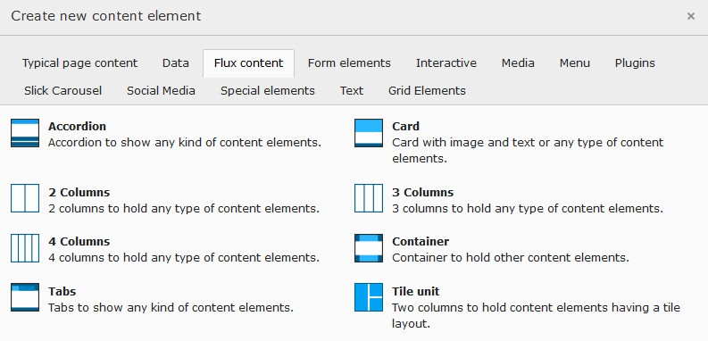

.. include:: ../Includes.txt

.. _user-design:

======
Design
======

The arrangement and appearance from content elements can be defined on different areas. The coarse structure is defined
with the page layout where structure elements like grid elements might further organize the content in columns,
registers, and the like. Fine tuning can be done on a content element basis by altering the frame, attributes and
background.

.. _user-design-page:

Page layout
===========

With a page layout the coarse page structure is defined. They can be selected in the page properties dialog under the
appearance tab. See as well `demo site <https://www.pizpalue.buechler.pro/das-plus/seitenlayout>`__.

.. figure:: ../Images/User/Page_Layouts.jpg
   :width: 500px
   :alt: Available page layouts

   Available page layouts

.. note::
   The page layouts with a navigation menu on the side allow to add content too.

.. _user-design-structurelements:

Structure elements
==================

With structure elements the content area might be further organized. Typical elements are containers, columns,
accordions and tabs. See as well `demo site <https://www.pizpalue.buechler.pro/das-plus/strukturemente>`__.

This extension supports the following extensions providing similar structure elements:

- `Extension pp_gridelements <https://extensions.typo3.org/extension/pp_gridelements>`__ powered by the
  `extension gridelements <https://extensions.typo3.org/extension/gridelements>`__
- `Extension flux_elements <https://extensions.typo3.org/extension/flux_elements>`__ powered by the
  `extension flux <https://extensions.typo3.org/extension/flux>`__

.. tip::
   Don't work with both extensions in one installation. Choose between `pp_gridelements` and `flux_elements` to
   minimize maintenance expense.

The available structure elements can be found in the new content element wizard under the `Grid Elements` or
`Flux content` tab:

.. figure:: ../Images/User/StructureElements_Gridelements.jpg
   :width: 500px
   :alt: "Grid Elements"-tab in new content element wizard

   "Grid Elements"-tab in new content element wizard

-----------------------------------------------------------------------------------------------------------------------

   "Flux content"-tab in new content element wizard

.. _user-design-contentElement:

Content element
===============

.. _user-design-image-tab:

Images tab
----------

Image cropping
~~~~~~~~~~~~~~

To faster crop images to be used in tiles the side ratios 2:1 and 1:2 were added.

.. note::
   When defining an image crop area with the same side ratio (e.g. 2:1) as used for the content element layout the
   image might not fill the entire tile area. This is due to the fact that the tile area is having the exact side
   ratio where the images side ratio deviates from that due to the tile border. After approximating the image area
   with the exact tile ratio select the free side ratio to fine adjust the area.

Image variants
~~~~~~~~~~~~~~

Usually the images are used in a content element using the content width. To optimize page loading time and reducing
the data bandwidth the image sizes are adapted to the content width. This works fine for most cases.

In case one likes to use images in a content element spanning a different width (e.g. the full page width) the
resolution might result to be too small resulting in not sharp images. For this situation the image variant selector
has been introduced allowing to adapt the image rendering to different sizes (e.g. "Full page width").

Image scaling
~~~~~~~~~~~~~

The image sizes for the different screen sizes are defined by the selected image variants as well as the image column
count.

Some times an editor adds additional elements for structuring the content area resulting in a smaller available space
for images. To deliver the optimal image size under such conditions a scaling can be defined.

As an example consider adding a two column grid element with the first column being 33% and the second column 67% from
the content width. Let's assume the two columns to be next to each other for screen sizes bigger than md. Now when
adding an image to the first column (33% width) the rendered image would be two times bigger than needed (due to the
system not knowing how much space is available in the column). To deliver optimal sized images the following scaling
definition could be used:

.. code-block:: text

   xl: 0.33,
   lg: 0.33,
   md: 0.33,
   sm: 1.0,
   xs: 1.0

.. _user-design-appearance-tab:

Appearance tab
--------------

.. _user-design-layouts:

Layouts
~~~~~~~

Three `tile layouts` and a `Layout screen breakpoint` selector were added.

By selecting a `Layout screen breakpoint` a css class is added to the content element allowing to adjust the layout
depending on the screen width. This is currently used in conjunction with tile layouts but might be used in other
contexts as well.

.. figure:: ../Images/User/ContentElement_Layouts.jpg
   :alt: Content element layouts and layout breakpoints

   Content element layouts and layout breakpoints

.. note::

   **Tile vies**

   Tile views can be created by arranging tiles in columns. For this the classes `pp-tile-row` and `no-gutters`
   are assigned to the row and `pp-tile-col` to the column tag. The extension
   `pp_gridelements <https://extensions.typo3.org/extension/pp_gridelements>` provides the structure element `tile unit`
   that assigns the mentioned classes directly.

   The tile border width can be adjusted in the constant editor (``PIZPALUE: CLIENT STYLE - Tile gutter``).

   In case a tile content needs to be vertically scrolled the class ``pp-tile-scroll-y`` might be assigned to the tile.

.. _user-design-customframes:

Custom frames
~~~~~~~~~~~~~

Additional frames can be selected for content elements
(`see example <https://www.pizpalue.buechler.pro/das-plus/gestaltung/rahmen/>`__):

.. figure:: ../Images/User/CustomFrames.jpg
   :alt: Custom frames for content elements

   Custom frames for content elements

.. note::
   The custom frame 4 doesn't have any style definition. You might use it according your needs.

.. _user-design-background:

Background
~~~~~~~~~~

The bootstrap package as well as this extension provide a way to assign a background to a content element.

The bootstrap package approach uses additional style definitions inside the content element container allowing to
define different images for different screen sizes. Additionally it provides easy image manipulations. In case no
frame should be used as well no background image can be assigned.

The extension is embedding a background image by adding an inline style definition. In case no frame is
selected the content is wrapped allowing always to have a background image.

.. _user-design-attributes:

Attributes
~~~~~~~~~~

Sometimes it would be handy to directly alter attributes from a content element. For example to assign additional
classes, some inline style or new attributes.

This functionality has been added by introducing additional fields to the content element table and adapting the
rendering accordingly. The new fields are available under the appearance tab in the "Attributes" section.

.. figure:: ../Images/User/ContentElement_Attributes.jpg
   :width: 500px
   :alt: Customizing attributes for a content element

   Customizing attributes for a content element

Some predefined classes and attributes can be assigned by help of the adjacent selector box. The selector box for
the "Additional attributes" field shows data attributes related to the
:ref:`scroll animation <config_scrollanimation>`.

.. note::
   For security reasons all attributes are filtered. Currently just data attributes are allowed in the "Additional
   attributes" field.

