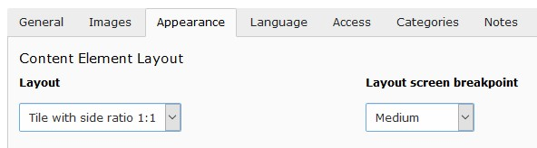

.. include:: ../Includes.txt

.. _user-design:

======
Design
======

The arrangement and appearance from content elements can be defined on different
areas. The coarse structure is defined with the page layout where structure
elements like container elements might further organize the content in columns,
registers, and the like. Fine tuning can be done on a content element basis
by altering the frame, attributes and background.

.. _user-design-page:

Page layout
===========

With a page layout the coarse page structure is defined. They can be selected
in the page properties dialog under the appearance tab. See as well
`demo site <https://pizpalue.buechler.pro/das-plus/seitenlayout>`__.

.. figure:: ../Images/User/Page_Layouts.jpg
   :width: 500px
   :alt: Available page layouts

   Available page layouts

.. note::

   The page layouts with a navigation menu on the side allow to add content too.

.. _user-design-structurelements:

Structure elements
==================

With structure elements the content area might be further organized. Typical
elements are containers, columns, grid, accordions and tabs. See as well
`demo site <https://pizpalue.buechler.pro/das-plus/strukturemente>`__.

This extension mainly supports the extension
`container_elements <https://extensions.typo3.org/extension/container_elements>`__
powered by the
`extension container <https://extensions.typo3.org/extension/container>`__.

The available structure elements can be found in the new content element wizard
under the `Container` tab:

.. figure:: ../Images/User/StructureElements_Container.jpg
   :width: 500px
   :alt: "Container"-tab in new content element wizard

   "Container"-tab in new content element wizard

.. _user-design-contentElement:

Content element
===============

.. _user-design-image-tab:

Images tab
----------

Image cropping
~~~~~~~~~~~~~~

To faster crop images to be used in tiles the side ratios 2:1, 3:4, 9:16 and 1:2
were added.

.. note::

   When defining an image crop area with the same side ratio (e.g. 2:1) as used
   for the content element layout the image might not fill the entire tile area.
   This is due to the fact that the tile area is having the exact side ratio
   where the images side ratio deviates from that due to the tile border. After
   approximating the image area with the exact tile ratio select the free side
   ratio to fine adjust the area.

Image variants
~~~~~~~~~~~~~~

Usually the images are used in a content element using the content width. To
optimize page loading time and reducing the data bandwidth the image sizes are
adapted to the content width. This works fine for most cases.

In case one likes to use images in a content element spanning a different width
(e.g. the full page width) the resolution might result to be too small resulting
in not sharp images. For this situation the image variant selector has been
introduced allowing to adapt the image rendering to different sizes (e.g.
"Full page width").

Image scaling
~~~~~~~~~~~~~

The image sizes for the different screen sizes are defined by the selected image
variants as well as the image column count.

Some times an editor adds additional elements for structuring the content area
resulting in a smaller available space for images. To deliver the optimal image
size under such conditions a scaling can be defined.

As an example consider adding a two column structure element with the first
column being 33% and the second column 67% from the content width. Let's assume
the two columns to be next to each other for screen sizes bigger than md. Now
when adding an image to the first column (33% width) the rendered image would
be two times bigger than needed (due to the system not knowing how much space
is available in the column). To deliver optimal sized images the following
scaling definition could be used:

.. code-block:: text

   xl: 0.33,
   lg: 0.33,
   md: 0.33,
   sm: 1.0,
   xs: 1.0

.. important::

   Before adjusting the image scaling manually make sure the images aren't yet
   created with the correct sizes. The extension `pizpalue` supports image
   scaling for structure elements by providing view helpers (see view helpers
   `Render/Bootstrap/Column`, `Structure/Wrap/Column` and
   `Structure/Multiplier/GetForColumn`) and adjusting the content element
   template. Extensions like `pp_gridelements` might already make use of them
   and deliver correct image sizes. See as well
   :ref:`Integration-Templating<integration_templating>`.

.. _user-design-appearance-tab:

Appearance tab
--------------

.. _user-design-tilelayouts:

Tile layouts
~~~~~~~~~~~~

Three `tile layouts` and a `Layout screen breakpoint` selector were added.

By selecting a `Layout screen breakpoint` a css class is added to the content
element allowing to adjust the layout depending on the screen width. This is
currently used in conjunction with tile layouts but might be used in other
contexts as well.

   Content element layouts and layout breakpoints

.. note::

   **Tile views**

   Tile views can be created by arranging tiles in columns. For this the classes
   `pp-tile-row` and `no-gutters` are assigned to the row and `pp-tile-col` to
   the column tag. The extension
   `pp_gridelements <https://extensions.typo3.org/extension/pp_gridelements>`__
   provides the structure element `tile unit` that assigns the mentioned classes
   directly.

   The tile border width can be adjusted in the constant editor
   (`PIZPALUE: CLIENT STYLE - Tile gutter`).

   In case a tile content needs to be vertically scrolled the class
   `pp-tile-scroll-y` might be assigned to the tile.

.. _user-design-customframes:

Custom frames
~~~~~~~~~~~~~

Additional frames can be selected for content elements
(`see example <https://pizpalue.buechler.pro/das-plus/gestaltung/rahmen/>`__):

.. figure:: ../Images/User/CustomFrames.jpg
   :alt: Custom frames for content elements

   Custom frames for content elements

.. note::

   The custom frame 4 doesn't have any style definition. You might use it
   according your needs.

.. _user-design-background-variants:

Background variants
~~~~~~~~~~~~~~~~~~~

As for the images a variants selector has been introduced for the background
images allowing to adapt the background image size to the container width.
In case a content element isn't embedded into a structure element it is likely
that it should be displayed on the entire display width hence `Full page width`
should be selected.

.. _user-design-background:

Background
~~~~~~~~~~

The bootstrap package offers a possibility to add a background image to the
content element.

Its configuration has been adapted to enable the background image as well when
no frame is used for the content element. In this case just a wrapping div is
added.

.. _user-design-attributes:

Attributes
~~~~~~~~~~

Sometimes it would be handy to directly alter attributes from a content element.
For example to assign additional classes, some inline style or new attributes.

This functionality has been added by introducing additional fields to the
content element table and adapting the rendering accordingly. The new fields
are available under the appearance tab in the "Attributes" section.

.. figure:: ../Images/User/ContentElement_Attributes.jpg
   :width: 500px
   :alt: Customizing attributes for a content element

   Customizing attributes for a content element

Some predefined classes and attributes can be assigned by help of the adjacent
selector box. The selector box for the "Additional attributes" field shows data
attributes related to the :ref:`scroll animation <config_scrollanimation>`.

.. note::

   For security reasons all attributes are filtered. Currently just data
   attributes are allowed in the "Additional attributes" field.

.. note::

   Style definitions will be included to the header when curly brackets are
   used. Otherwise they will be added inline.

.. note::

   When defining styles the key `#self` can be used to refer to the content
   elements id attribute. Example:
   `#self .frame-inner { border: red 1px dashed; }`
