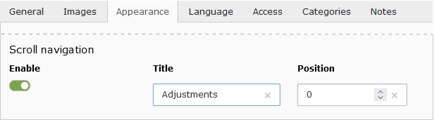
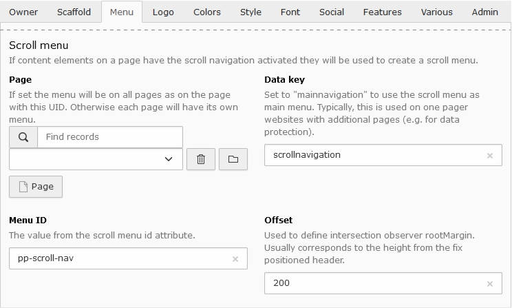

.. include:: /Includes.rst.txt

.. _user-scrollmenu:

============
Scroll menu
============

.. _user-scrollmenu-creation:

Creation
========

   Scroll navigation properties from a content element

The scroll menu is created by activating the scroll navigation property from
content elements. The title field can be used to overwrite the default text
used for the menu entry by the headings field where the position field allows
to further define the order from the item in the menu.

.. _user-scrollmenu-usage:

Usage
=====

A scroll menu can be created when content elements have the scroll navigation
activated. By default just content elements for the active page are considered
resulting in a :ref:`local scroll menu <user-scrollmenu-localmenu>` for that
particular page. By help of the :ref:`easyconf form <config-easyconf>` as well
a :ref:`global scroll menu <user-scrollmenu-globalmenu>` used in one pager
websites can be set up.

   Easyconf form to define the usage from the scroll menu

.. _user-scrollmenu-localmenu:

Local menu
----------

By default the scroll menu is included to the main menu. In case the menu should
be shown else where the `navigation DropIn
<https://github.com/buepro/typo3-pizpalue/blob/main/Resources/Private/Partials/Page/DropIn/Navigation/MainAfter.html>`__
has to be overwritten and the `partial ScrollNavigation
<https://github.com/buepro/typo3-pizpalue/blob/main/Resources/Private/Partials/Page/Navigation/ScrollNavigation.html>`__
can be referenced in a template.

.. note::

   For the scroll navigation to work correctly the id from the navigation
   menu has to be defined. This can be done by setting the `Menu ID` in
   the :ref:`easyconf form <user-scrollmenu-usage>`.

.. _user-scrollmenu-globalmenu:

Global menu
-----------

A global scroll menu shows the same menu items on all pages. This is typically
used in one pager websites. Usually these sites consist of a main page with
all the essential business content and some side pages (e.g. a page with content
regarding the user data protection). For showing the same scroll menu on all
pages a page has to be assigned to the property `Page` in the
:ref:`easyconf form <user-scrollmenu-usage>` and the properties `Data key` and
`Menu ID` have to be set to "mainnavigation".

.. note::

   When assigning a page to the property `Page` using the
   :ref:`easyconf form <user-scrollmenu-usage>` the properties `Data key` and
   `Menu ID` might be changed to "mainnavigation" upon saving the form.
