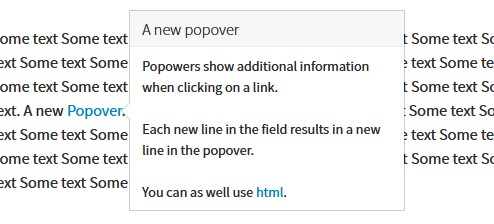
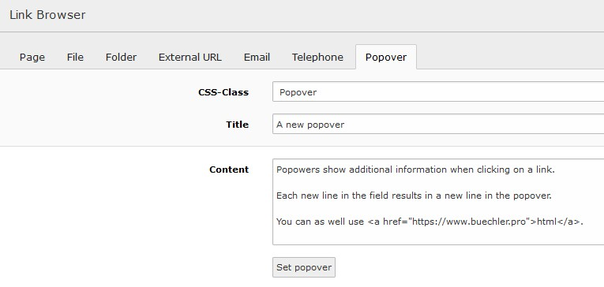
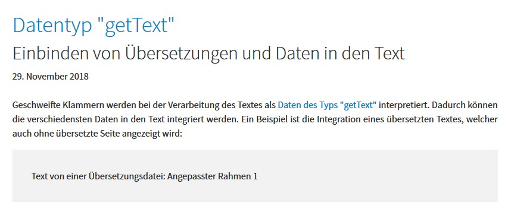

.. include:: ../Includes.txt

.. _user-various:

=======
Various
=======

.. _user-data-popover:

Popover
=======

   A popover in the front end

Popovers show additional information in a small window. Mainly they are associated with a link (see
`popovers component from bootstrap framework <https://getbootstrap.com/docs/4.5/components/popovers/>`__).

Create a popover
----------------

This extension provides an easy way to use popovers by defining them in the RTE editor:

1. Select the text that should be associated with a popover
2. Click the create link button
3. In the link browser dialog select the register `Popover`
4. Select the class `Popover` and define the title and content

   Register popover in link browser

Adjust a popover
----------------

To adjust a popovers behaviour related attributes might be added to the link tag. The following link results in a
popover showing up when hovering over the link text where clicking on it loads the TYPO3 home page.

.. code-block:: html

   <a class="pp-popover" data-trigger="hover" href="t3://pppopover?href=https://typo3.org&amp;content=A+text" title="A title">item</a>

.. note::
   The popover content is parsed the same way as the RTE text by using the configuration from `lib.parseFunc_RTE`
   hence TYPO3 specific links can be used (e.g. `t3://page?uid=6`).

.. _user-data-getText:

Data from type getText
======================

The `getText data type <https://docs.typo3.org/typo3cms/TyposcriptReference/DataTypes/Index.html#gettext>`__ can be
enabled for the RTE editor. It allows to get various data from a web site. As an example a translated text might be
retrieved depending on the currently selected page language. For this users might reference data by using curly
brackets within the editor
(`see example <https://pizpalue.buechler.pro/das-plus/gestaltung/attribute/wissenswertes>`__):

   Use of localized text within the editor

.. tip::
   You might reference other content as defined by the
   `"getText" data type <https://docs.typo3.org/typo3cms/TyposcriptReference/DataTypes/Gettext/Index.html>`__.

The feature can be enabled through the constant editor selecting the category `PIZPALUE: CUSTOMER EXTENDED`
(constant: `pizpalue.features.content.insertData`).

.. warning::
   Enabling this feature allows editors to output sensitive data. Enable it only if security isn't compromised.

.. _usr-ppClasses:

Pizpalue classes
=================

General
-------

These classes act on the element they are assigned to.

============================= =============================================================================
Class                         Usage
============================= =============================================================================
pp-bg-primary                 Applies the primary color to the background
pp-bg-secondary               Applies the secondary color to the background
pp-bg-complementary           Applies the complementary color to the background
pp-bg-light                   Applies the light color to the background
pp-bg-dark                    Applies the dark color to the background
pp-bg-centercover             Centers the background and sizes it to cover the area.
pp-bg-fixed                   Fixes the background. The result is a parallax effect. Due to mobile devices
                              not supporting this feature fully it is generally disabled on mobile devices.
============================= =============================================================================

Card backgrounds
----------------

============================= =============================================================================
Class                         Usage
============================= =============================================================================
pp-card-primary               Applies the primary color to the card background
pp-card-secondary             Applies the secondary color to the card background
pp-card-complementary         Applies the complementary color to the card background
pp-card-light                 Applies the light color to the card background
pp-card-dark                  Applies the dark color to the card background
============================= =============================================================================

Content element inner
---------------------

These classes change the inner frame from a content element.

============================= =============================================================================
Class                         Usage
============================= =============================================================================
pp-inner-margin               Applies a margin to the inner container
pp-inner-padding              Applies a padding to the inner container
pp-inner-bgwhite70            Applies a white background with 70% opacity to the inner container
pp-inner-bggrey70             Applies a grey background with 70% opacity to the inner container
pp-inner-bgblack70            Applies a black background with 70% opacity to the inner container
============================= =============================================================================

Gallery / Image
---------------

These classes are used in conjunction with galleries (images, text & images)

============================= =============================================================================
Class                         Usage
============================= =============================================================================
pp-gallery-item-left          Aligns the gallery items (e.g. images) to the left
pp-gallery-item-right         Aligns the gallery items to the right
pp-gallery-item-join          Joins the gallery items by removing any margin and padding
pp-gallery-item-shadow        Adds a shadow to the gallery items
pp-image-overlay              Overlays the heading to the image. Used with image content element
============================= =============================================================================

Content element transformation
------------------------------

These classes transform a content element. They influence various elements and might be used in JS.

============================= =============================================================================
Class                         Usage
============================= =============================================================================
pp-ce-overlaycard             Render an overlay card when being assigned to a text & image content element.
(DEPRECATED since 30.6.2021)  An overlay card is characterized by an animation taking place when the
                              user hovers over the image. The animation fades in the text from the
                              content element.
                              DEPRECATED: Use Picture with overlay content element
============================= =============================================================================

Utility
-------

These classes are used in templating or together with JS.

============================= =============================================================================
Class                         Usage
============================= =============================================================================
pp-cf                         Micro clearfix hack
pp-label-dataprotection       Used in content element to define a replacement text for a data
                              protection notice check box (see contact page).
pp-parent-height              Elements using this class will get the same height as their parent element
pp-row-height                 Elements in a row using this class will have the same height (wrapping
                              containers).
pp-row-child-height           Elements in a row using this class will have their direct child elements
                              harmonized. Each child element will have the same height as its neighbour
                              element in an other column. The class just works with "Text with images"
                              content elements.
pp-below-header               Used to shift a content element below the page header by applying a negative
                              top margin.
pp-extend-link                Assign this class to a link to make the closest ancestor container with class
                              `frame-container` linked to the same url. Alternatively the ancestor container
                              can be defined by the class `ppc-el-[ancestorclass name]`.
ppc-el-[ancestor class name]  Used in conjunction with the class `pp-extend-link`. Overwrites the default
                              link ancestor. Replace `[ancestor class name]` with the class used in the
                              ancestor container. As an example when assigning the classes
                              `pp-extend-link ppc-el-up-my-container` to an a-tag the closest ancestor from
                              the link having the class `up-my-container` assigned to will be linked to
                              the same url as defined in the a-tag.
============================= =============================================================================

RTE
---

The following classes are used in the context of the real text editor.

============================= =============================================================================
Class                         Usage
============================= =============================================================================
pp-popover                    Used to control the behaviour from popovers.
                              Popovers that were triggered from elements having this class close when the
                              user clicks outside the popover.
============================= =============================================================================
