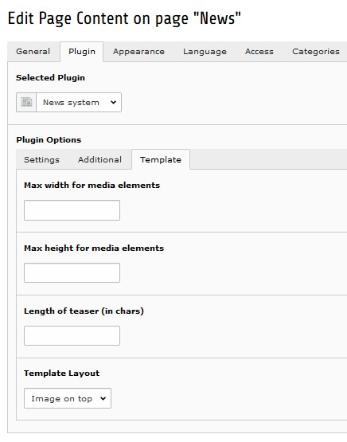
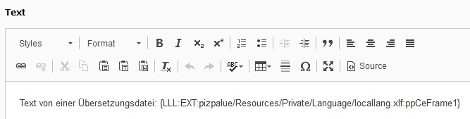

.. include:: ../Includes.txt

.. _user-various:

=======
Various
=======

.. _user-extensions:

Extensions
==========

This distribution provides some additions to extensions. Additional information might be found in the manual user
section from the related extensions.

.. _user-news:

News
----

For the news system a template "Image on top" is provided. It might be used to
render the image on top of the text (`see example <https://www.pizpalue.buechler.pro/das-plus/news/>`__).

   News template to render image on top

.. _user-data-getText:

Data from type getText
======================

The `getText data type <https://docs.typo3.org/typo3cms/TyposcriptReference/DataTypes/Index.html#gettext>`__ allows
to get various data from a web site. As an example a translated text might be retrieved depending on the currently
selected page language. For this users might reference data by using curly brackets within the editor
(`see example <https://www.pizpalue.buechler.pro/das-plus/gestaltung/attribute/wissenswertes>`__):

   Use of localized text within the editor

.. tip::
   You might reference other content as defined by the
   `"getText" data type <https://docs.typo3.org/typo3cms/TyposcriptReference/DataTypes/Gettext/Index.html>`__.

.. _usr-ppClasses:

Pizpalue classes
=================

General
-------

These classes act on the element they are assigned to.

============================= =============================================================================
Class                         Usage
============================= =============================================================================
pp-bg-primary                 Applies the primary color to the background
pp-bg-secondary               Applies the secondary color to the background
pp-bg-complementary           Applies the complementary color to the background
pp-bg-light                   Applies the light color to the background
pp-bg-dark                    Applies the dark color to the background
pp-bg-centercover             Centers the background and sizes it to cover the area.
pp-bg-fixed                   Fixes the background. The result is a parallax effect. Due to mobile devices
                              not supporting this feature fully it is generally disabled on mobile devices.
============================= =============================================================================

Content element inner
---------------------

These classes change the inner frame from a content element.

============================= =============================================================================
Class                         Usage
============================= =============================================================================
pp-inner-margin               Applies a margin to the inner container
pp-inner-padding              Applies a padding to the inner container
pp-inner-bgwhite70            Applies a white background with 70% opacity to the inner container
pp-inner-bggrey70             Applies a grey background with 70% opacity to the inner container
pp-inner-bgblack70            Applies a black background with 70% opacity to the inner container
============================= =============================================================================

Gallery items
-------------

These classes are used in conjunction with galleries (images, text & images)

============================= =============================================================================
Class                         Usage
============================= =============================================================================
pp-gallery-item-left          Aligns the gallery items (e.g. images) to the left
pp-gallery-item-right         Aligns the gallery items to the right
pp-gallery-item-join          Joins the gallery items by removing any margin and padding
pp-gallery-item-shadow        Adds a shadow to the gallery items
============================= =============================================================================

Content element transformation
------------------------------

These classes transform a content element. They influence various elements and might be used in JS.

============================= =============================================================================
Class                         Usage
============================= =============================================================================
pp-ce-overlaycard             Render an overlay card when being assigned to a text & image content element.
                              An overlay card is characterized by an animation taking place when the
                              user hovers over the image. The animation fades in the text from the
                              content element.
============================= =============================================================================

Utility
-------

These classes are used in templating or together with JS.

============================= =============================================================================
Class                         Usage
============================= =============================================================================
pp-cf                         Micro clearfix hack
pp-label-dataprotection       Used in content element to define a replacement text for a data
                              protection notice check box (see contact page)
pp-parent-height              Elements using this class will get the same height as their parent element
pp-row-height                 Elements in a row using this class will have the same height
pp-row-child-height           Elements in a row using this class will have their direct child elements
                              harmonized. Each child element will have the same height as its neighbour
                              element in an other column. The class just works with "Text with images"
                              content elements.
============================= =============================================================================

